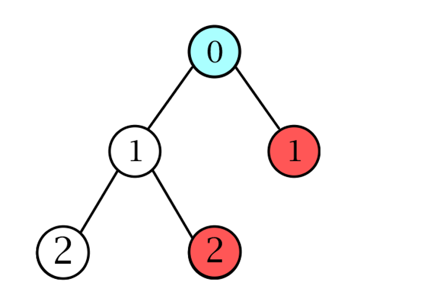
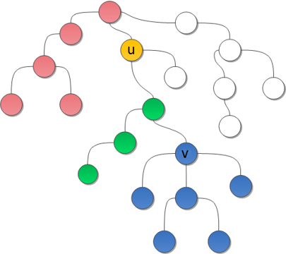

# Tarjan-Algorithm

Алгоритм используется  для нахождения наименьшего общего предка. Уже эта задача является достаточно нужной, но из-за того, что есть возможность приводить задачу RMQ к задаче LCA алгоритм становиться ещё более востребовательным.

Алгоритм создан известным американским учёным в области вычислительных систем Робертом Тарьяном.

Данный алгоритм был открыт им в 1979 году и решал офлайн задачу LCA, то есть когда все запросы уже известны. 

Алгоритм Тарьяна является отличным инструментом для решения офлайн задач LCA. Он достаточно легко реализуется и не требует больших затрат памяти и времени.
Достоинство его легкой реализации можно использовать для решения задач RMQ сведенных к LCA, это даст отличную выгоду по времени.

В ходе выполнения работы я реализовал консольное приложение для решения задачи LCA с поддержкой загрузки графа из файла.

